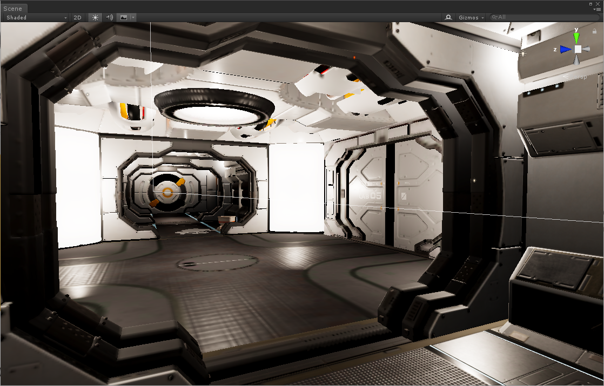
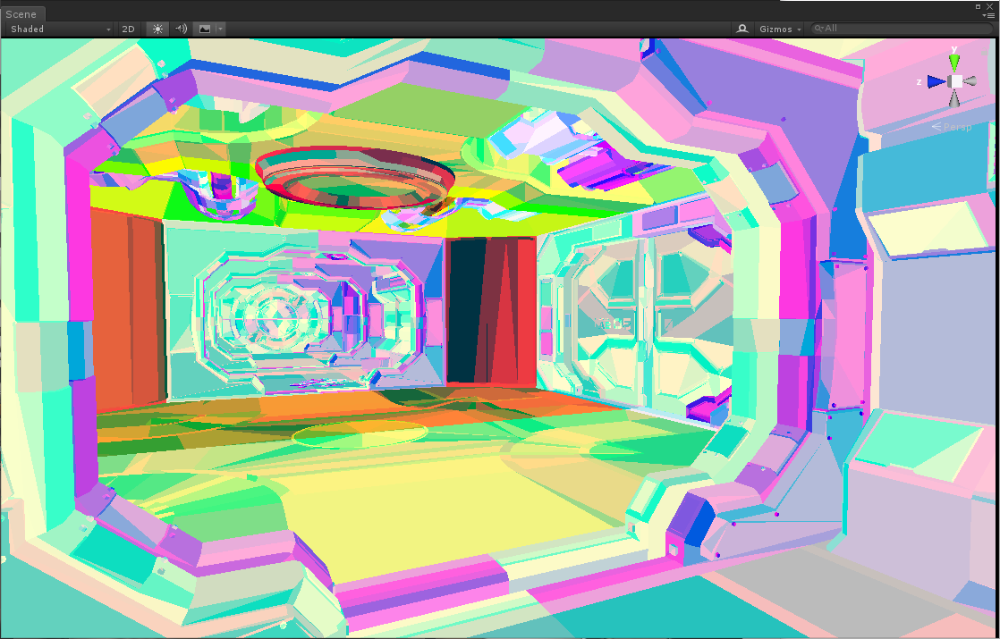
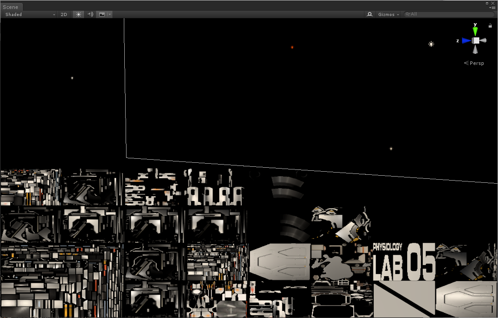

# SweetTexelShading
Texel-Shading with Unity's ScriptableRenderPipeline

# What is this?
A custom rendering pipeline for Unity which implements texel shading.
Texel shading means that all sorts of lightning and effects are rendendered on the objects texture before the object is actually rendered in 3D. 

# Why?
 * VR and 4K demand high on fillrate and memory bandwitdth.
 * Shader Aliasing is still a issue in current Games.

Texel shading could potentially solve both problems by allowing to render shading on a lower frame rate than the scene is rendered.

# How (Work in Progress)?
 1. Scene is rendered with information about each objects unique ID, triangle ID and mipmap level per Pixel. 
 
 2. A Compute shader extracts the visibile triangles and the lowest visible mip map level for each object.
 3. Texture atlas packing is generated with a Morten / Z-Shape code
 4. Objects are rendered in texture space.
  
 5. Render the scene with the texel shaded objects.
 
 All of this happens on the GPU so far! :)

# Futher Research
* Use per triangle UVs for robout unwraping. (See http://ptex.us/ptexpaper.html)
* ...
